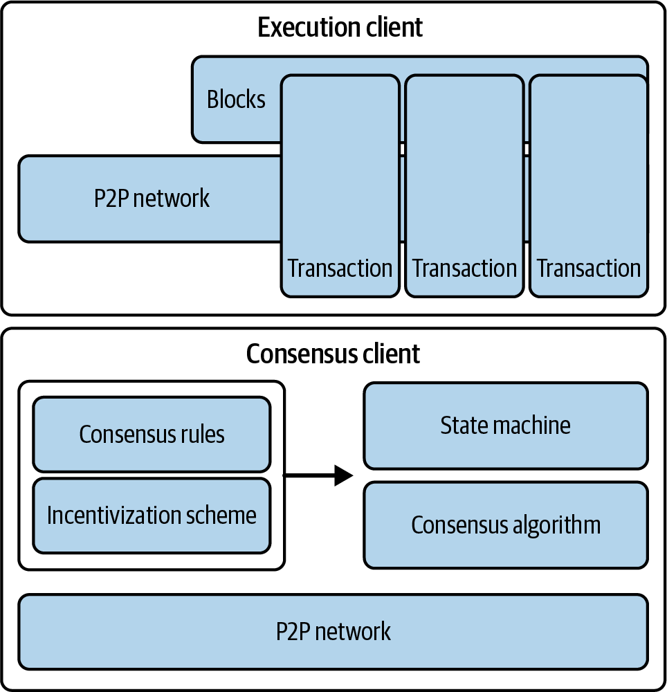

# What is Ethereum?

Computer Science perspective: It is a state machine that can run programs of any complexity. It has a shared global state that everyone can access, and a virtual machine that processes changes to that state.

Practical perspective: It is a decentralized computing platform that runs programs called smart contracts. It uses a blockchain to keep track of all changes across the network.

## Ethereum Compared to Bitcoin

### Similarities

- A peer-to-peer network connecting participants
- A consensus mechanism that keeps the network synchronized even if some participants are unreliable
- The use of cryptography, such as digital signatures and hashes
- A digital currency (ether)

### Differences

- Ethereum is a general-purpose programmable blockchain that can run complex programs, while Bitcoin has a very limited scripting language
- Ethereum's programming language is Turing complete (can solve any computational problem), whereas Bitcoin's scripting language is intentionally limited to simple true/false checks for spending conditions
- In September 2022, Ethereum further distinguished itself from Bitcoin with The Merge upgrade, transitioning from proof of work (PoW) to proof of stake (PoS)

## Components of a Blockchain

- A peer-to-peer network that connects participants and shares transactions
- Transactions that represent changes to the system's state
- Rules that define what makes a transaction valid
- A system that processes and validates transactions according to these rules
- A chain of secure blocks that records all verified transactions
- A consensus mechanism that ensures all participants agree on which transactions are valid
- An incentive system (like rewards for miners/validators) that encourages people to secure the network
- Software programs ("clients") that implement these components

Initially, Ethereum required a single client before its transition to PoS. However, Ethereum now uses two separate clients: one for consensus and another for execution. Instead of having one official implementation, Ethereum uses a written specification that multiple teams can implement.

Figure 1-1 shows a graphical representation of the blockchain components.

## The Birth of Ethereum

- Toward the end of 2013, Vitalik Buterin started thinking about further extending the capabilities of Bitcoin.
- In December 2013, Buterin started sharing a whitepaper that outlined the idea behind Ethereum: a general-purpose blockchain that can run any program (Turing-complete).
- Both of the original authors of this book, Andreas M. Antonopoulos and Dr. Gavin Wood, received an early draft of the whitepaper and commented on it.
- Starting in December 2013, Buterin and Wood refined and evolved the idea, working together to build the protocol that became Ethereum.
- It created the foundation for entirely new sectors like decentralized finance, NFTs, and decentralized autonomous organizations (DAOs), which wouldn't have been possible with earlier single-purpose blockchains.
- On July 30, 2015, the first Ethereum block was mined. The world’s computer started serving the world.

## Ethereum's Stages of Development

Ethereum's development was planned over four distinct stages: Frontier, Homestead, Metropolis, and Serenity.

### Frontier (July 30, 2015)

- Launched at the very first block (Genesis), it prepared the foundation for miners and developers by enabling the setup of mining rigs, starting ETH token trading, and testing DApps.
- Initially, blocks had a gas limit of five thousand, but that was lifted in September 2015, allowing for transactions and introducing the "difficulty bomb."
- Ethereum's difficulty bomb is a mechanism designed to gradually increase the difficulty of mining over time, eventually making it too difficult to mine profitably.

### Homestead (March 14, 2016)

- Started at block 1,150,000, it made Ethereum safer and more stable through key protocol updates (EIP-2, EIP-7, and EIP-8).
- These upgrades made it easier for developers to work with Ethereum and set the stage for further improvements, although the network was still in beta.

### Metropolis (October 16, 2017)

- Starting at block 4,370,000, it aimed to increase network functionality, making it easier to create DApps and improving overall network usefulness.
- Significant upgrades like Byzantium, Constantinople, and Istanbul during this phase reduced transaction costs, enhanced security, and introduced layer-2 (L2) scaling solutions.
- Byzantium reduced mining rewards and added new cryptographic features.
- Constantinople further reduced transaction costs and allowed interactions with addresses that don't exist yet.
- Istanbul made the network more resistant to attacks and introduced zero-knowledge proofs (zk-SNARKs and STARKs), which allow verification without revealing information, improving scalability and privacy.
- These enhancements collectively set the stage for Ethereum 2.0, representing the final phase of Ethereum 1.0.

### Serenity (September 15, 2022)

- Commonly known as Ethereum 2.0, represents a major upgrade aimed at transforming Ethereum from a PoW to a PoS consensus mechanism.
- This stage addresses critical issues like high energy consumption and network congestion, clearing the way for a more robust and efficient blockchain.

### The Serenity upgrade is divided into several substages:

#### The Merge

The Merge combines Ethereum's mainnet with the Beacon Chain (a separate chain that was handling PoS consensus), officially transitioning the network to PoS and reducing energy consumption significantly.

#### The Surge

The Surge introduces sharding, increasing Ethereum’s scalability by splitting the network into smaller, manageable pieces, which allows for more transactions per second.

#### The Scourge

The Scourge addresses issues of centralization and censorship resistance, ensuring that Ethereum remains a decentralized and open network.

#### The Verge

The Verge implements Verkle trees, a new data structure that reduces the data storage required for nodes, improving network efficiency and scalability.

#### The Purge

The Purge aims to reduce the historical data stored on Ethereum, simplifying node operation and lowering network congestion.

#### The Splurge

The Splurge includes various minor upgrades and optimizations to ensure that Ethereum runs smoothly and efficiently after all major changes are implemented.

## Ethereum: A General-Purpose Blockchain

- Ethereum is a distributed system that tracks changes to a general-purpose data store, which can hold any data organized as key-value pairs.
- A key-value data store holds any values you want, each identified by a unique key. In some ways, this works like the memory (RAM) used by regular computers.
- Like a general-purpose, stored-program computer, Ethereum can load code into its state machine and run that code, storing the resulting state changes in its blockchain.
- Two of the critical differences from most general-purpose computers are that Ethereum state changes are governed by the rules of consensus and the state is distributed globally.

## Ethereum's Components

### Peer-To-Peer Network

Ethereum runs on the Ethereum main network, which uses TCP port 30303, and runs a protocol called [*ÐΞVp2p*](https://oreil.ly/pUfGC).

### Consensus rules

Ethereum's original consensus protocol was Ethash, a PoW model defined in the "Yellow Paper" specification. It then evolved to PoS in September 2022 during The Merge upgrade.

### Transactions

Ethereum transactions are network messages that include a sender, a recipient, a value, and a data payload.

### State machine

Ethereum state changes are processed by the *Ethereum Virtual Machine* (EVM), a virtual machine that executes *bytecode* (low-level instructions that computers understand). EVM programs called *smart contracts* are written in high-level languages (e.g., Solidity) and compiled to bytecode for execution on the EVM.

### Data structures

Ethereum's state is stored locally on each node as a *database*, which contains the transactions and system state in a special hashed data structure called a *Merkle-Patricia trie*.

### Consensus algorithm

Ethereum transitioned from a PoW to a PoS consensus mechanism to improve energy efficiency and scalability. In PoS, validators stake their cryptocurrency to earn the right to validate transactions, create new blocks, and maintain network security. Ethereum's PoS combines two algorithms: Casper the Friendly Finality Gadget (FFG) and GHOST (Greedy Heaviest Observed Subtree) with latest message driven (LMD) updates.

### Economic security

Ethereum uses a PoS algorithm called Gasper that provides economic security to the blockchain. Gasper ensures transactions are finalized and coordinates validators to work together.

### Clients

Ethereum has several compatible implementations of its execution and consensus client software. The most popular are *go-ethereum* (Geth) and Nethermind for execution, and Prysm and Lighthouse for consensus.

## Ethereum and Turing Completeness

- Ethereum's ability to execute stored programs in the EVM while reading and writing data to memory makes it a Turing-complete system (a *Universal Turing Machine*).
- Ethereum can compute any algorithm that can be computed by any computer, given the limitations of finite memory.
- Ethereum combined the general-purpose computing architecture of a stored-program computer with a decentralized blockchain, creating a distributed world computer with a single shared state.
- Ethereum programs run “everywhere” yet produce a common state that is secured by the rules of consensus.

## Implications of Turing Completeness

- Turing proved that we cannot predict the path of a program without running it.
- Turing-complete systems can run in infinite loops.
- A smart contract can be created such that it runs forever when a node attempts to validate it. This is effectively a denial-of-service (DoS) attack.
- Ethereum introduced a metering mechanism called gas. When a transaction is triggered, it must include an amount of gas that sets the upper limit of computation that can be used when running the smart contract.
- Ether needs to be sent along with a transaction, and it needs to be set explicitly for the purchase of gas, along with an acceptable gas price.

## From General-Purpose Blockchains to DApps

- Ethereum started as a way to make a general-purpose blockchain, but very quickly, Ethereum's vision expanded to become a platform for building DApps.
- In 2004, the term Web 2.0 came to prominence as a label of the evolution of the web toward user-generated content, responsive interfaces, and interactivity.
- Web3 represents a new vision and focus for web applications: from centrally owned and managed applications to applications built on decentralized protocols.

## Ethereum’s Development Culture

- In Bitcoin, changes are only implemented if they are backward compatible. Existing clients are allowed to opt in but will continue to operate if they decide not to upgrade. 
- This cautious approach aligns with Bitcoin's governance model, where changes go through the Bitcoin Improvement Proposal (BIP) process, an intentionally slow process that requires broad agreement to preserve stability.
- In Ethereum, the community’s development culture is focused on the future rather than the past. If a change is needed, it is implemented, even if that means invalidating prior assumptions, breaking compatibility, or forcing clients to update. 
- Ethereum's governance reflects this more hands-on style, with coordination happening publicly through frequent AllCoreDevs calls where researchers, client teams, and community members discuss and agree on upcoming changes.
- One of the big challenges facing developers in Ethereum is the conflict between deploying code to an immutable system and a development platform that is still evolving. You can't simply "upgrade" your smart contracts.
- Ironically, this also means that the goal of building systems with more autonomy and less centralized control is still not fully realized.
- Autonomy and decentralization require a bit more stability in the platform than you’re likely to get in Ethereum in the next few years.
- Eventually, the development of the Ethereum platform will slow, and its interfaces will become fixed.
