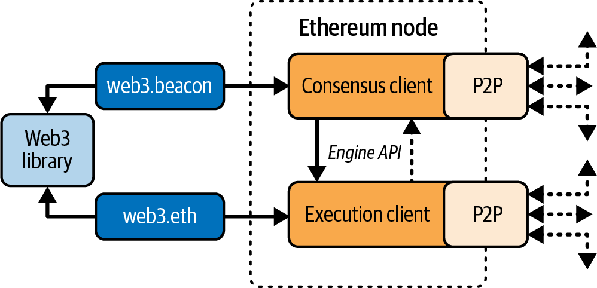

# Ethereum Nodes

An Ethereum node is a software application that implements the Ethereum specification and communicates over the P2P network with other Ethereum nodes.

## Post-Merge Architecture

**Before The Merge:** A node ran a single client for PoW.

**After The Merge (PoS):** A node must run two separate clients:

- **Consensus client:** Manages the consensus protocol, allowing all nodes to agree on blockchain history
- **Execution client:** Receives blocks and transactions, executes them in the EVM, and verifies correctness

Both clients communicate via the **Engine API** using a shared JWT secret for authentication. While implemented by different teams in different languages, they follow the same protocol and rules.

## Ethereum Specification

- **Execution specification:** Documented in a paper combining English and mathematical (formal) descriptions
- **Consensus specification:** Written in Python
- **EIPs:** Ethereum Improvement Proposals define standard behavior
- Unlike Bitcoin (which uses Bitcoin Core as the reference), Ethereum uses written specifications that multiple teams implement independently

## Ethereum Networks

Several EVM-compatible chains (Ethereum Classic, BNB Chain, Polygon) share large portions of the execution spec but may differ in consensus and parameters.

## Ethereum Clients

### Execution Clients

- **Geth** (Go) - Oldest, most widely used, maintained by Ethereum Foundation
- **Nethermind** (C#)
- **Besu** (Java)
- **Erigon** (Go)
- **Reth** (Rust) - New, created by Paradigm after Parity/OpenEthereum was discontinued

### Consensus Clients

- **Lighthouse** (Rust) - Most used, maintained by Sigma Prime
- **Lodestar** (TypeScript)
- **Nimbus** (Nim)
- **Prysm** (Go) - First consensus client, now maintained by Offchain Labs (37% market share)
- **Teku** (Java)

## Node Types

### Archive Nodes

- Keep all data indefinitely, including all historical states
- Use cases: Block explorers, analytics, debugging
- Requires significantly more storage (several TB)

### Full Nodes

- Discard historical state and receipts (default type)
- Sufficient for normal validation and most users/developers
- Can prune old data to save space

### Light Clients

- Download and validate block headers and Merkle proofs
- Provide near-full-node security with minimal storage
- Can verify transaction inclusion without storing full blockchain

### Remote Clients

- Offer wallet functionality without storing blockchain or validating data
- Connect to full nodes, public networks, testnets, or private blockchains
- Examples: MetaMask, Rabby Wallet, Coinbase Wallet
- **Trade-off:** Trust full nodes for blockchain access (less security/privacy) unless connected to your own full node

## Should I Run a Full Node?

### Full Node: Advantages

- Supports network resilience and censorship resistance
- Authoritatively validates all transactions
- Interact with any contract without intermediaries
- Deploy contracts directly to public blockchain
- Query blockchain status offline
- Query blockchain privately (no third party knows what you're reading)

### Full Node: Disadvantages

- Requires significant and growing hardware/bandwidth resources
- May take several days to fully sync initially
- Must be maintained, upgraded, and kept online to remain synced

### Public Testnets: Advantages

- Much less data to sync (~100-300 GB as of June 2025)
- Can fully sync in a few hours
- Free test ether from faucets
- Public blockchains with many users and contracts running "live"

### Public Testnets: Disadvantages

- No real money (can't test security against real adversaries)
- Transaction fees have no economic value
- Don't experience mainnet-level congestion
- May differ slightly from mainnet (purpose-specific testnets)

### Local Blockchain Simulation (Anvil)

**Advantages:**
- No syncing required; you produce the first block
- Award yourself block rewards for testing
- No other users or contracts (clean slate)
- Can fork mainnet at arbitrary blocks for mainnet-like state

**Disadvantages:**
- Doesn't behave like a public blockchain (no transaction competition)
- Predictable block production (can't test all public blockchain scenarios)
- Must deploy all dependencies yourself (though forking helps)

## Running an Ethereum Node

### Hardware Requirements

**Minimum:**
- CPU: 2+ cores
- Storage: 2+ TB free space
- RAM: 8 GB (SSD highly preferable)
- Internet: 7+ Mbps download

**Recommended:**
- CPU: 4+ cores (clock speed > core count)
- RAM: 16+ GB
- Storage: Fast NVMe SSD, 2+ TB free
- Internet: 24+ Mbps download

### Software Requirements

- Both execution and consensus clients required
- Install Go and/or Rust depending on chosen clients
- Works on macOS and Linux (Windows: use WSL2)

### Key Setup Concepts

- **JWT Secret:** Shared authentication file (`jwt.hex`) between execution and consensus clients
- **Engine API:** Communication protocol between the two clients (port 8551)
- **Two processes:** Execution client runs first, consensus client connects to it
- **Checkpoint sync:** Consensus clients can use checkpoint URLs to speed up initial sync
- **Client combinations:** Popular pairs include Geth-Prysm, Reth-Lighthouse

**Official documentation:**
- [Geth](https://oreil.ly/zYviP) | [Prysm](https://oreil.ly/9-2FC) | [Reth](https://oreil.ly/KDmMt) | [Lighthouse](https://oreil.ly/RRpAs)

*Note: Full installation instructions available in official docs. Initial sync can take several days.*

## Synchronization

### Sync Modes

- **Full sync:** Downloads and validates every block and transaction from genesis
- **Fast sync:** Skips full validation until synced to tip, then validates backward
- **Snap sync:** Downloads recent state snapshots for faster initial sync

### Historical Sync Challenges

New clients make rapid progress until block 2,283,397 (Sept 18, 2016), which marks the beginning of DoS attacks. From blocks 2,283,397 to 2,700,031 (Nov 26, 2016), validation becomes extremely slow, memory-intensive, and I/O-intensive. Fast sync helps bypass this bottleneck.

## The JSON-RPC Interface

- Interface allowing programs to use an Ethereum client as a gateway to the network
- Typically offered as HTTP service on port 8545
- **Security:** Restricted by default to localhost (127.0.0.1) only
- Enables interaction with blockchain: querying state, sending transactions, deploying contracts

## Remote Ethereum Clients

Remote clients offer a subset of full client functionality without storing the blockchain. They're faster to set up and require minimal storage.

### Capabilities

- Manage private keys and Ethereum addresses
- Create, sign, and broadcast transactions
- Interact with smart contracts
- Browse and interact with DApps
- Link to external services (block explorers)
- Convert ether units and retrieve exchange rates
- Inject Web3 instance into browser
- Access RPC services on local or remote nodes

### Types

- **Mobile Wallets:** Operate as remote clients (smartphones lack resources for full nodes)
- **Browser Wallets:** Browser extensions (Chrome, Firefox) running as remote clients
- **Hardware Wallets:** Offline devices designed to resist tampering and physical attacks, providing higher security
